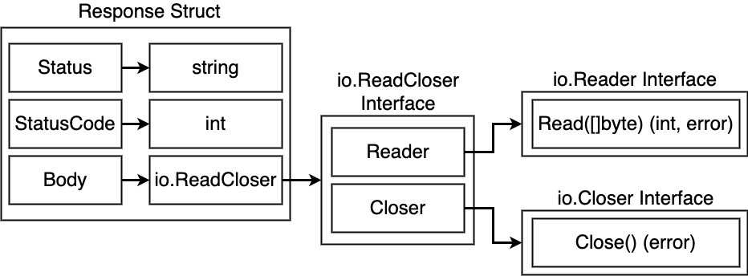
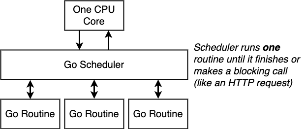
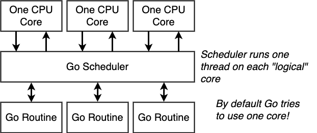
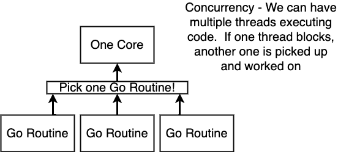
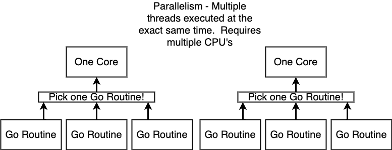
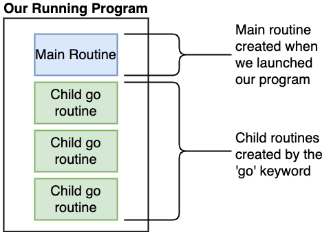
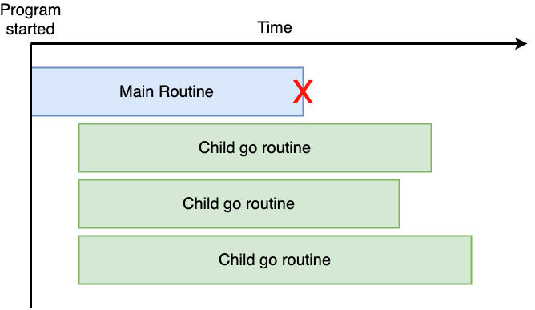
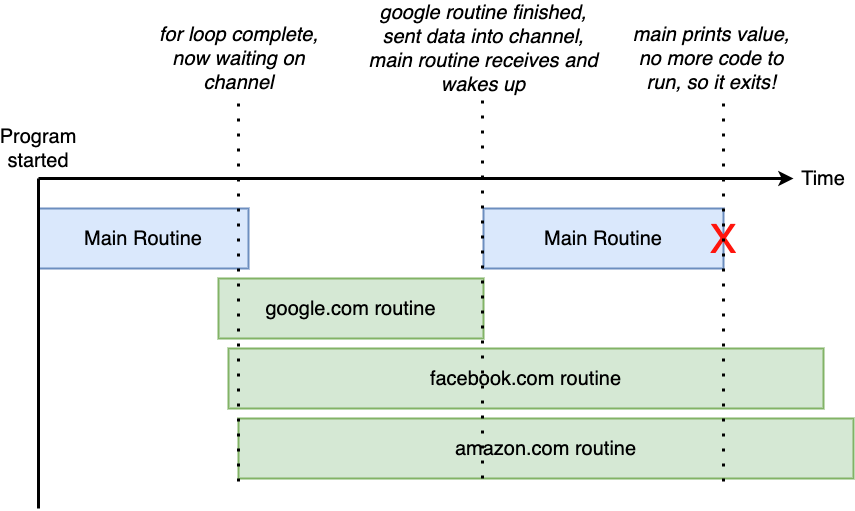

## About The Project

- Go: The Complete Developer's Guide (Golang)
- Master the fundamentals and advanced features of the Go Programming Language (Golang)
- Tutorial for GoCasts
- [Original Repo: GoCasts](https://github.com/StephenGrider/GoCasts)
- [Stephen Grider](https://github.com/StephenGrider)

&nbsp;

---

&nbsp;

## Basics

```sh
go
go run main.go
go help packages
```

- <b>Type of packages:</b>
  - <b>Executable:</b> Generates a file that we can run (<i>"main" is special</i>)
  - <b>Reusable:</b> Code used as 'helpers'. Good place to put reusable logic
- <code>package main</code> Defines a package that can be compiled and then _executed_. <b>Must have a func called 'main'</b>
- <code>package calculator</code> Defines a package that can be used as a dependency (helper code)
- <code>package uploader:</code> Defines a package that can be used as a dependency (helper code)
- Variables can be initialized outside of a function, but cannot be assigned a value.

&nbsp;

---

&nbsp;

```sh
# https://stackoverflow.com/questions/58018729/go-linter-in-vs-code-not-working-for-packages-across-multiple-files
# Initialize new module in current directory
go mod init gocasts
```

```go
var card string = "Ace of Spades"
```

- [Linux File/Directory Permissions cheat sheet](https://www.thegeekdiary.com/linux-file-directory-permissions-cheat-sheet/)
- [What is the difference between concurrency, parallelism and asynchronous methods?](https://stackoverflow.com/questions/4844637/what-is-the-difference-between-concurrency-parallelism-and-asynchronous-methods)
- [Threading Tutorial #1 - Concurrency, Threading and Parallelism Explained](https://www.youtube.com/watch?v=olYdb0DdGtM)
- [Package fmt verbs](https://pkg.go.dev/fmt)

&nbsp;

---

&nbsp;

## Structs & Maps

|  Type  | Zero Value |
| :----: | :--------: |
| string |     ""     |
|  int   |     0      |
| float  |     0      |
|  bool  |   false    |

- GO is pass by value
- <b>RAM</b>

| Address |            Value            |     |
| :-----: | :-------------------------: | :-: |
|  0000   |                             |     |
|  0001   | person{firstName: "Jim"...} | jim |
|  0002   | person{firstName: "Jim"...} |  p  |
|  0003   |                             |     |

```go
// &variable : Give me the memory address of the value this variable is pointing at
// *pointer : Give me the value this memory address is pointing at

// *person : This is a type description - it means we're working with a pointer to a person
// *pointerToPerson : This is an operator - it means we want to manipulate the value the pointer is referencing

func (pointerToPerson *person) updateName(newFirstName string) {
	(*pointerToPerson).firstName = newFirstName
}

// Turn address into value with *address
// Turn value into address with &value
```

&nbsp;

---

&nbsp;

> <b>Dipesh: </b> Gotchas With Pointers
>
> This is not actually gotcha of pointer. To understand this we need to understand memory type and immutability. As you said in previous videos, go make copy of data to make it change, it is because of go's characteristic of immutability. Now, any variable stored on memory has two options, it could be added in stack(when it has fix size) or in heap memory(when it need to allocate more size then it will actually consume). Here slice is not fixed size element, as you said in previous videos, it can be shrink or expand. Pointer can change value by reference when it is in stack, but if any variable is stored in heap memory, it can be change directly as it is stored on memory which has greater amount of memory already allocated.

|          Arrays          |                   Slices                   |
| :----------------------: | :----------------------------------------: |
| Primitive data structure |            Can grow and shrink             |
|     Can't be resized     | Used 99% of the time for lists of elements |
|   Rarely used directly   |                                            |

| Value Types | Reference Types |
| :---------: | :-------------: |
|     int     |     slices      |
|    float    |      maps       |
|   string    |    channels     |
|    bool     |    pointers     |
|   structs   |    functions    |

- When we create a slice, Go will automatically create which two data structures?
  - An array and a structure that records the length of the slice, the capacity of the slice, and a reference to the underlying array

&nbsp;

---

&nbsp;

|                         Map                         |                            Struct                             |
| :-------------------------------------------------: | :-----------------------------------------------------------: |
|       All keys & values must be the same type       |                Values can be of different type                |
|     Keys are indexed - we can iterate over them     |                  Keys don't support indexing                  |
|                   Reference Type                    |                          Value Type                           |
| Use to represent a collection of related properties | Use to represent a "thing" with a lot of different properties |
|   Don't need to know all the keys at compile time   |   You need to know all the different fields at compile time   |

- Map is good for closely related items liek color and hex codes

&nbsp;

---

&nbsp;

## Interfaces

- We know that...
  - Every value has a type
  - Every function has to specify the type of its arguments
- So does that mean...
  - Every function we ever write has to be rewritten to accommodate different types even if the logic in it is identical?

```go
type bot interface {
  getGreeting(string, int)(string, error)
}

// Function name
// List of argument types
// List of return types
```

| Concrete Type | Interface Type |
| :-----------: | :------------: |
|      map      |      bot       |
|    struct     |                |
|      int      |                |
|    string     |                |
|  englishBot   |                |

|                                                                 |                                                                                                                      |
| :-------------------------------------------------------------: | :------------------------------------------------------------------------------------------------------------------: |
|                Interfaces are not generic types                 |                            Other languages have 'generic' types - go (famously) does not.                            |
|                    Interfaces are 'implicit'                    |                     We don't manually have to say that our custom type satisfies some interface.                     |
|        Interfaces are a contract to help us manage types        | GARBAGE IN -> GARBAGE OUT. If our custom type's implementation of a function is broken then interfaces wont help us! |
| Interfaces are tough. Step #1 is understanding how to read them | Understand how to read interfaces in the standard lib. Writing your own interfaces is tough and requires experience  |



- [Reader Interface](https://pkg.go.dev/io#Reader)

&nbsp;

---

&nbsp;

## Goroutines


&nbsp;

&nbsp;

&nbsp;

&nbsp;

&nbsp;

&nbsp;


- [A Tour of Go - Channels](https://go.dev/tour/concurrency/2)
- [WaitGroup](https://pkg.go.dev/sync#WaitGroup)

&nbsp;

---

&nbsp;

> <b>David: </b> Function literals
> Function literals can be pretty tricky to understand at first. The best way to describe it is that function literals can be used either in-place (what the author does) or as values, assigned to a variable name. Let's start with a simpler example than the one in the lesson, which creates an function literal (sometimes also referred to as an "anonymous" or "unnamed" function) and executes it in-place:

```go
    func() {
        fmt.Println("my function was executed")
    }()
```

> This is valid Go code that, when run, will print the line "my function was executed". The reason it executes immediately is because it's not only being defined, but it's also being called, by placing the () at the end of the function definition. This will become clearer very soon. Let's do the same thing as above, but instead of executing it immediately, let's assign it to a variable name. A variable name you say? Yes. Go actually has a func() type just like int, bool, string, etc., that can be assigned to a variable:

```go
    var myFunc func() // declare a variable named myFunc of type func()
    myFunc = func() { // assign a function literal to the myFunc variable
        fmt.Println("my function was executed")
    }
```

> Or, you can use Go's := to do the same thing more succinctly:

```go
    myFunc := func() {
        fmt.Println("my function was executed")
    }
```

> This is the same way I declared the function literal at the top of this answer, only I assigned it to a variable instead of immediately executing it. Note that the func() type is made up of the whole function signature. So for a function that doesn't accept any arguments its type is func() while a function that accepts a string and int64 as arguments would have a type of func(string, int64) and so on.
>
> You can confirm the type of the myFunc variable just like any other variable:

```go
    fmt.Printf("myFunc's type is %T\n", myFunc)
    // prints: myFunc's type is func() <-- a function assigned to a variable of type func()
```

> Now that you have a function assigned to the myFunc variable, you can execute it by placing parentheses () after it, just like any other function:

```go
    myFunc()
    // prints: my function was executed
```

> The parentheses is what causes the function to execute. The above code is identical in behavior to defining and executing named functions, which we all recognize:

```go
func myFunc() {
    fmt.Println("my function was executed")
}

func main() {
    myFunc()  // prints: my function was executed
}
```

> But why would we use function literals (executed immediately or assigned to variable names) instead of the usual way? As in the lesson video, because it's convenient and easy to read, and it's the only way you can create a function inside of another function. You need a function for a particular task but you are never going to need it elsewhere in your code, so why not just define and execute it in-place instead of creating a named function that will never be called again and that you need to scroll elsewhere in the code to find? In other scenarios, assigning a function literal to a variable allows you to treat it as a value that you can pass around to other functions:

```go
func main() {
    myFunc := func() {
        fmt.Println("my function was executed")
    }
    runMyFunction(myFunc)
}

// runMyFunction takes a function, f, as an argument and executes it
func runMyFunction(f func()) {
    f() // execute the function that was passed in
    // prints: my function was executed
}
```

> Here's something you might find interesting: Just as you can execute function literals immediately without assigning them to variables first (as the author does in the video), you can also pass function literals to other functions directly without assigning them to a variable first. Just like any other literal, you can pass a function literal as a value. This code has the exact same behavior as the code above:

```go
func main() {
    runMyFunction(func() { fmt.Println("my function was executed") })
}

func runMyFunction(f func()) {
    f() // execute the function that was passed in
    // prints: my function was executed
}
```

> Hopefully this helps shed more illumination on the topic of function literals.

&nbsp;

---

&nbsp;
